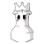

#  Chess Royale 

UTN - Facultad Regional Buenos Aires - Materia Paradigmas de Programación

## Equipo de desarrollo: 

- Santino Bouvet
- Franco Vinaccia
- Santino Sommaruga
- Felipe Pampin
- Lautaro Pingitore
 

## Capturas 

## Reglas de Juego / Instrucciones

El objetivo del juego es controlar al rey negro y sobrevivir la mayor cantidad del tiempo posible, moviendonos de arriba hacia abajo y disparando a las piezas blancas para poder eliminarlas antes que ellas a nosotros.

## Controles:

- `W` para moverse hacia arriba
- `S` para moverse hacia abajo
- `Space` para disparar
- `P` para pausar el juego
- `R` para reiniciar el juego una vez terminado

## Como implementamos los conceptos del paradigama?
En nuestro juego aplicamos varios conceptos del paradigma orientado a objetos, como el polimorfismo entre distintas clases u objetos, y la idea de que todo es un objeto, incluidas las funciones.

El polimorfismo se puede ver principalmente en dos casos: en el método reaccionar(objeto, bala) que tiene el rey negro, y en el método aparecerPieza() del objeto spawnEnemigo.

En la función reaccionar(objeto, bala) usamos polimorfismo porque, en ese momento, no importa qué tipo de objeto es el que reacciona, sino que buscamos que pueda entender el mensaje recibirDaño, que es parte de la función. Como siempre va a ser una pieza blanca, al tener ese método en cada pieza, nos evitamos tener que hacer un if para cada una en particular.

Por otro lado, en la función spawnEnemigo() también usamos polimorfismo para evitar hacer un número aleatorio y luego un montón de ifs para que, dependiendo del número, aparezca una pieza u otra. Al asignar directamente una pieza a una constante y luego hacer que esa constante entienda el mensaje empezarMoverse(), nos ahorramos repetir lógica y usamos un enfoque más acorde al paradigma.

Finalmente, en el objeto spawnEnemigo usamos una lista de funciones, lo que hace mucho más fácil la creación de enemigos. Al poner algo como const pieza = [new Peon(), new Caballo()].anyOne(), logramos que la función sea más simple, corta y flexible. Si en el futuro queremos agregar una nueva pieza, solo tenemos que sumarla a la lista, sin cambiar casi nada del código.

## Diagrama de Clases

